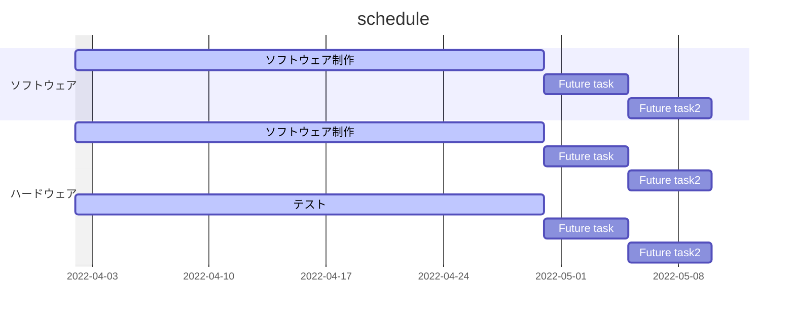

#Longhao

```mermaid
gantt  
dateFormat YYYY-MM-DD
title schedule
excludes weekdays 2022-04-02
	section ソフトウェア
ソフトウェア制作 :active,  des2, 2022-04-02, 28d  
Future task : des3, after des2, 5d  
Future task2 : des4, after des3, 5d
	section ハードウェア
ソフトウェア制作 :active,  des2, 2022-04-02, 28d  
Future task : des3, after des2, 5d  
Future task2 : des4, after des3, 5d
テスト :active,  des2, 2022-04-02, 28d  
Future task : des3, after des2, 5d  
Future task2 : des4, after des3, 5d
```

##デバッグ
#EOFエラーを避けるため、端末の開発者オプションからログバッファサイズを4MB以上に設定してください。